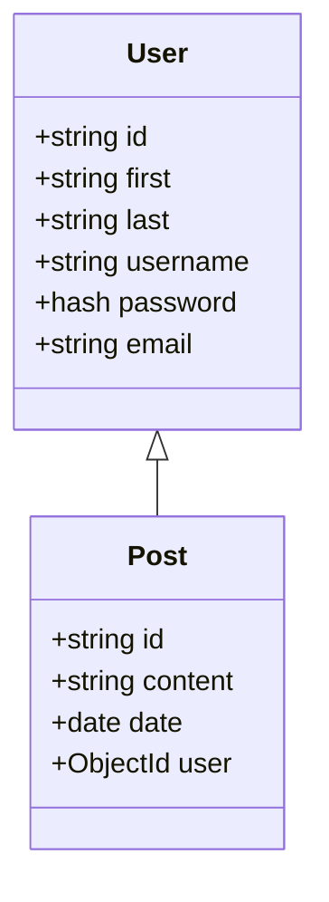

# [LIVE DEMO] ()

# Members Only - A Simple Social Media Application

## Background

This application was programmed as a submission for the assignment "Members Only" in The Odin Project.
Members Only is a simple social media application, created using Express.JS.

## Architecture

The application has the following stack:

- Backend: Express
- View engine: PUG
- Styling: Tailwind
- Authentication: Passport
- Database: MongoDB, with Mongoose
- Encryption: Bcrypt
- Other middleware: Express-validator, Session, Helmet, Express-Rate-Limiter, etc.

The architecture can be simply explained with the following short description:

### Database and Schema

### Sequence

In short:

- The User controller uses the User middleware to get, create, delete, edit and authenticate users.
- The Post controller uses the Post middleware to get, create and delete posts.
